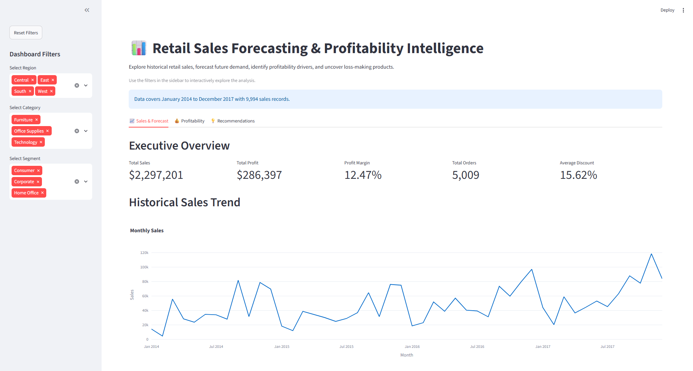
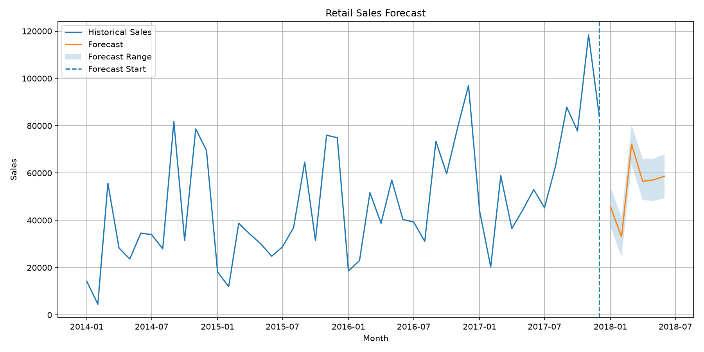
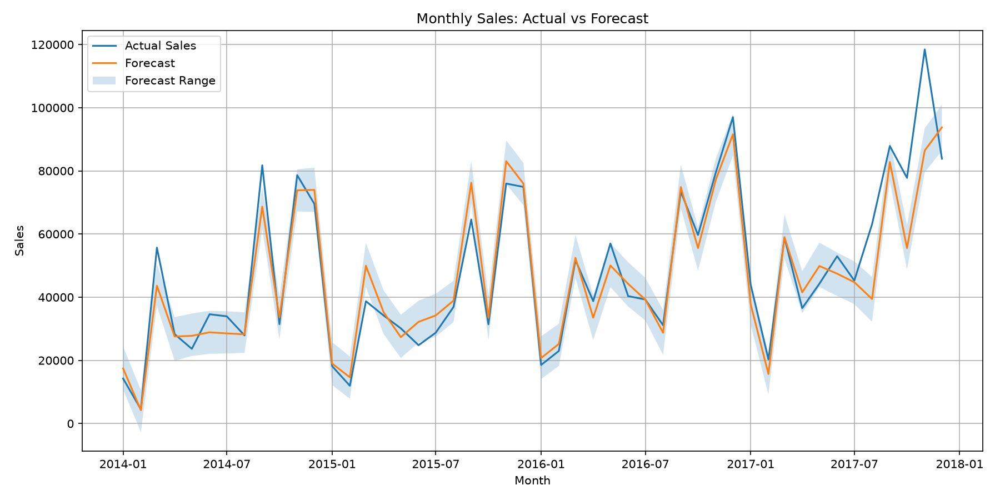
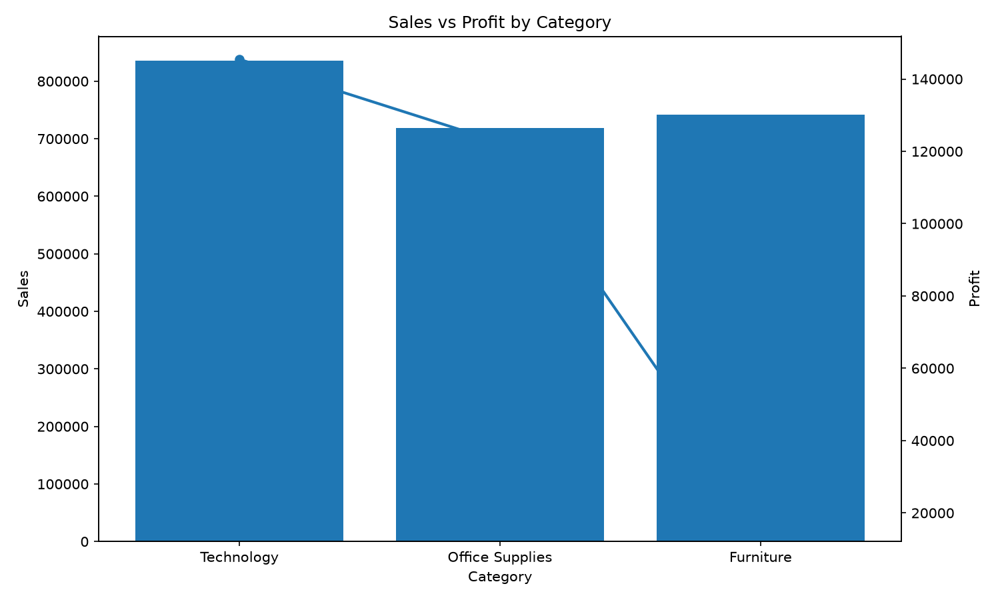
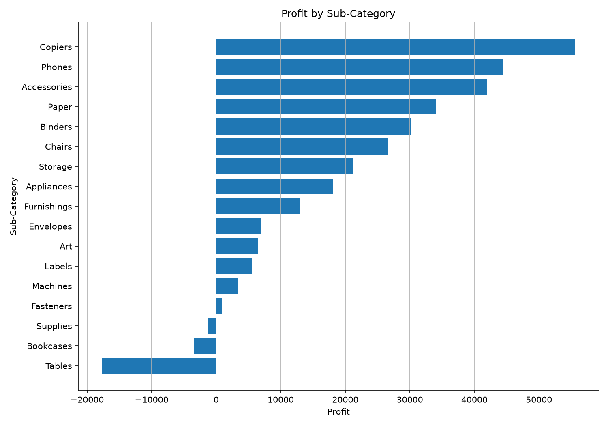
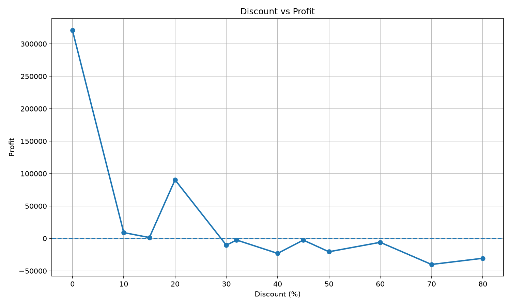

# Retail Sales Forecasting & Profitability Intelligence

An end-to-end retail analytics project that combines historical sales analysis, time-series forecasting, profitability analysis, and an interactive Streamlit dashboard.

The project uses the Superstore dataset to identify sales trends, forecast the next 6 months of sales, evaluate profitability across categories and products, and generate actionable business recommendations.

## Dashboard Preview

🚀 **[Live Interactive Dashboard](https://retail-sales-forecasting-by-nupin.streamlit.app/)**




The interactive dashboard provides:

- Executive sales and profitability KPIs
- Historical monthly sales trends
- 6-month sales forecasting
- Forecast uncertainty ranges
- Category and sub-category profitability analysis
- Loss-making product identification
- Discount vs. profitability analysis
- Interactive Region, Category, and Segment filters
- Business recommendations

## Project Highlights

- Analyzed 9,994 retail sales records covering 2014–2017
- Aggregated transaction-level data into monthly sales for forecasting
- Built and evaluated a Prophet time-series forecasting model
- Compared Prophet against a naive forecasting baseline
- Forecasted sales for the next 6 months
- Analyzed profitability across categories, sub-categories, and products
- Identified loss-making products and sub-categories
- Examined the relationship between discount levels and profitability
- Built an interactive Streamlit dashboard with dynamic filters
- Generated business recommendations from the analysis

## Key Metrics

| Metric | Value |
|---|---:|
| Total Sales | $2.30M |
| Total Profit | $286.40K |
| Profit Margin | 12.47% |
| Total Orders | 5,009 |
| Total Quantity | 37,873 |
| Average Discount | 15.62% |
| Average Shipping Days | 3.96 |
| Historical Period | 2014–2017 |
| Forecast Horizon | 6 Months |

## Technology Stack

- **Python** — Core programming and analysis
- **Pandas** — Data cleaning and transformation
- **NumPy** — Numerical calculations
- **Matplotlib & Seaborn** — Exploratory data visualization
- **Plotly** — Interactive dashboard visualizations
- **Prophet** — Time-series sales forecasting
- **Scikit-learn** — Forecast evaluation and baseline comparison
- **Streamlit** — Interactive web dashboard
- **Git & GitHub** — Version control and project management

## Forecasting Methodology

The project uses a chronological train-test approach to evaluate sales forecasting performance.

### Data Preparation

- Transaction-level sales data was aggregated into monthly sales.
- The dataset contains 48 monthly observations from January 2014 to December 2017.
- The first 42 months were used for training.
- The final 6 months were reserved as an unseen test period.

### Model Evaluation

A **Prophet** time-series model was trained using yearly seasonality.

Two Prophet configurations were evaluated:

| Model | MAE | RMSE |
|---|---:|---:|
| Prophet — Additive | $15,576.36 | $19,171.18 |
| Prophet — Multiplicative | $16,347.14 | $19,401.87 |

A naive previous-month baseline was also evaluated:

| Model | MAE | RMSE |
|---|---:|---:|
| Naive Baseline | $22,616.45 | $25,642.18 |

The **additive Prophet model** achieved the lowest MAE and RMSE, so it was selected for the final forecast.

### Final Forecast

After evaluation, the selected model was retrained using the complete historical dataset and used to forecast the next **6 months** of sales.

The forecast includes an expected sales value along with an uncertainty range.

## Profitability Analysis & Key Insights

### Category Performance

- **Technology** generated the highest overall profit at approximately **$145.45K**.
- **Office Supplies** generated approximately **$122.49K** in profit.
- **Furniture** generated approximately **$18.45K** despite having substantial sales, resulting in a much lower profit margin.

### Sub-Category Performance

- **Copiers** were among the strongest contributors to profit, generating approximately **$55.62K**.
- **Tables** were the largest loss-making sub-category, with approximately **-$17.73K** in profit.
- **Bookcases** and **Supplies** also recorded negative profitability.

### Discount Analysis

Higher discount levels were associated with significantly lower profitability in the dataset.

- Discounts of **30% and above** frequently resulted in negative profit.
- The **70% discount level** recorded approximately **-$40.08K** in profit.
- The relationship should be interpreted as an **association in this dataset**, not proof that discounts alone caused the losses.

### Loss-Making Products

The analysis identified individual products generating significant losses.

The largest loss-making product was:

**Cubify CubeX 3D Printer Double Head Print**

with approximately **-$8.88K** in total profit.

These products can be investigated further through pricing, discount, cost, and demand analysis.

## Business Recommendations

Based on the analysis, the following actions could improve profitability and support better planning:

1. **Review High-Discount Sales**
   - Carefully evaluate discounts of 30% and above.
   - Consider setting discount limits for products with weak margins.

2. **Improve Furniture Profitability**
   - Furniture generates substantial sales but comparatively low profit.
   - Review pricing, product costs, and discount strategies, particularly for Tables and Bookcases.

3. **Focus on High-Performing Products**
   - Continue investing in profitable Technology and high-margin sub-categories such as Copiers and Accessories.

4. **Investigate Loss-Making Products**
   - Review products with consistently negative profit.
   - Consider repricing, reducing discounts, renegotiating costs, or discontinuing products where appropriate.

5. **Use Forecasts for Planning**
   - Use the 6-month sales forecast to support inventory, sales, and resource planning.
   - Pay particular attention to expected seasonal demand changes.

6. **Monitor Profitability Alongside Sales**
   - High sales do not necessarily indicate strong business performance.
   - Track both revenue and profit when making product and category decisions.

## Project Structure

```text
retail-sales-forecasting/
├── data/
│   ├── processed/
│   │   ├── category_profitability.csv
│   │   ├── discount_profitability.csv
│   │   ├── loss_making_products.csv
│   │   ├── monthly_sales.csv
│   │   ├── sales_forecast.csv
│   │   └── subcategory_profitability.csv
│   │
│   └── raw/
│       └── Superstore.csv
│
├── screenshots/
│   ├── actual_vs_forecast.png
│   ├── category_sales_profit.png
│   ├── dashboard.png
│   ├── discount_profit.png
│   ├── sales_forecast.png
│   └── subcategory_profitability.png
│
├── src/
│   ├── data_preparation.py
│   ├── forecast_visualization.py
│   ├── forecasting.py
│   ├── profitability_analysis.py
│   └── profitability_visualization.py
│
├── .gitignore
├── app.py
├── README.md
└── requirements.txt
```

## How to Run the Project

### 1. Clone the Repository

```bash
git clone https://github.com/nupinjangid/retail-sales-forecasting.git
cd retail-sales-forecasting
```

### 2. Create a Virtual Environment

```bash
python -m venv .venv
```

Activate it on Windows:

```bash
.venv\Scripts\activate
```

### 3. Install Dependencies

```bash
pip install -r requirements.txt
```

### 4. Run the Streamlit Dashboard

```bash
streamlit run app.py
```

The dashboard will open in your browser.

### 5. Explore the Dashboard

Use the sidebar filters to explore:

- Sales and forecast trends
- Profitability by category and sub-category
- Loss-making products
- Discount vs. profitability
- Business recommendations

## Visualizations

### Sales Forecast



### Actual vs Forecast



### Category Sales & Profit



### Sub-Category Profitability



### Discount vs Profitability



## Project Objective

The objective of this project is to demonstrate an end-to-end retail analytics workflow — from raw transaction data and exploratory analysis to forecasting, profitability intelligence, interactive visualization, and business recommendations.

---

**Built with Python, Pandas, NumPy, Prophet, Scikit-learn, Plotly, Matplotlib, Seaborn, and Streamlit.**